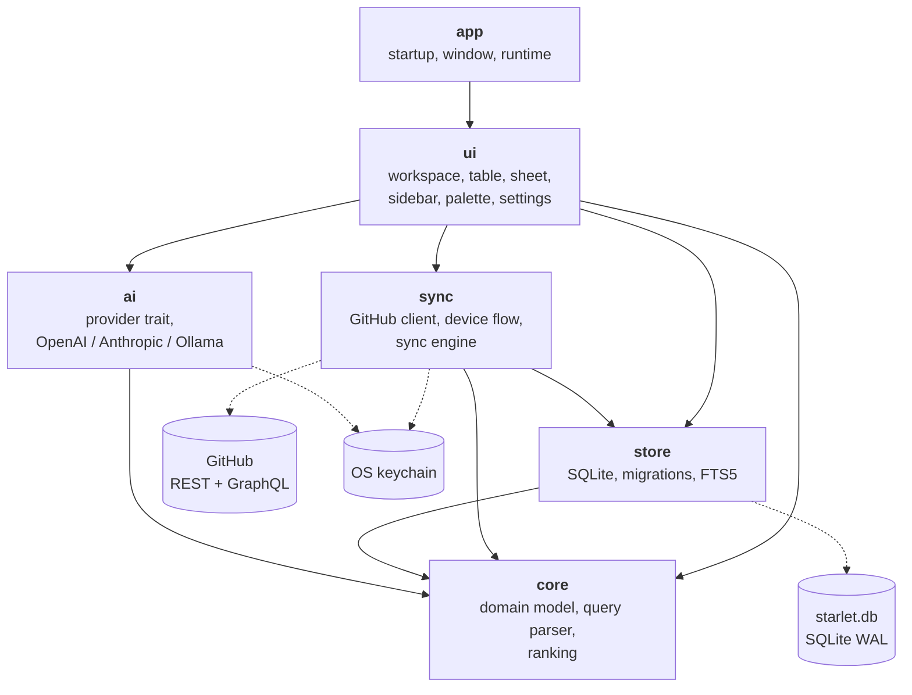

<picture>
  <source media="(prefers-color-scheme: dark)" srcset="docs/assets/starlet-mark-dark.svg">
  
</picture>

# Starlet

A local-first desktop search engine for your GitHub stars. Native Rust,
[GPUI][gpui], SQLite. Signed out it opens on one button; signed in, one input
on a dark canvas — type and the results are already there.

Starlet mirrors your stars into a local database and searches that. The search
path never touches the network, so results appear in under a millisecond
whether you are online or not.

**[Developer documentation →][docs]** — architecture, per-crate reference,
extension guides, query syntax, the SQL schema, and the decision log.

---

## What it does

**Search.** Fuzzy matching on `owner/name` plus BM25 full-text over
descriptions, topics, and tags, blended 70/30. `hlxed` finds `helix-editor`;
`wings` finds `sharkdp/bat`. The ranking is documented in
[Ranking][docs-ranking].

**Filter.** Prefixes in the query — `lang:rust`, `tag:cli`, `owner:tokio-rs`,
`stars:>1000`, `is:archived`, `sort:recent` — and a collapsible sidebar of tag
and group facets.

**Sync.** A background engine pages your stars from GitHub into SQLite, keeps
metadata fresh with conditional requests, and notices unstars. Once at launch,
then every fifteen minutes.

**Tag, optionally.** Bring your own key for OpenAI, Anthropic, or a local
Ollama, and Starlet will tag and group your stars. It ships no key, runs
nothing on launch, shows the estimated cost before it starts, and never
overwrites a tag you wrote yourself.

## Install

Requires Rust 1.98 (pinned in `rust-toolchain.toml`).

```sh
git clone https://github.com/prdlk/starlet
cd starlet
cargo run --release
```

**Linux build prerequisites** — Vulkan, Wayland/X11, xkbcommon, fontconfig,
D-Bus, and a C toolchain:

```sh
# Debian/Ubuntu
sudo apt-get install build-essential cmake pkg-config clang libclang-dev \
  libvulkan-dev libxkbcommon-dev libxkbcommon-x11-dev libwayland-dev \
  libx11-dev libxcb1-dev libfontconfig1-dev libdbus-1-dev

# Arch
sudo pacman -S base-devel cmake clang vulkan-icd-loader vulkan-headers \
  libxkbcommon libxkbcommon-x11 wayland libx11 libxcb fontconfig dbus
```

macOS and Windows need no extra packages.

The database lives in the OS data directory —
`~/.local/share/starlet/starlet.db` on Linux,
`~/Library/Application Support/starlet/starlet.db` on macOS. Set `STARLET_DB`
to point somewhere else.

### Try it without a GitHub account

```sh
cargo run -p starlet-store --example seed -- /tmp/starlet-demo.db 5000
STARLET_DB=/tmp/starlet-demo.db cargo run --release
```

## Registering the GitHub App

Starlet authenticates as a **GitHub App** using the device flow, so there is no
client secret and no embedded browser. You register your own App once:

1. Go to **Settings → Developer settings → GitHub Apps → New GitHub App**
   (or `https://github.com/settings/apps/new`).
2. **GitHub App name**: anything, for example `Starlet (yourname)`.
   **Homepage URL**: anything, for example this repository.
3. Under **Identifying and authorizing users**, tick
   **Enable Device Flow**. This is the setting that makes the whole flow work;
   without it the sign-in dialog will report that the request was rejected.
4. Untick **Webhook → Active**.
5. **Permissions → Account permissions**: set **Starring** to
   **Read-only**. That is the only permission Starlet needs.
6. **Where can this GitHub App be installed?** → **Only on this account**.
7. Create the App, then **Install App** on your own account.
8. Copy the **Client ID** from the App's settings page (it looks like
   `Iv23li…`).

Then either bake it in at build time:

```sh
STARLET_GITHUB_CLIENT_ID=Iv23liXXXXXXXXXXXXXX cargo build --release
```

or supply it at runtime:

```sh
STARLET_GITHUB_CLIENT_ID=Iv23liXXXXXXXXXXXXXX cargo run --release
```

Click **Sign in**, type the code GitHub shows you, and the first sync starts.
The token is written to your OS keychain — Keychain on macOS, Credential
Manager on Windows, Secret Service on Linux — and never to the database, a
config file, or a log line.

Without a client ID Starlet still runs: it searches whatever is already in the
local database and tells you the ID is missing when you try to sign in.

## Bring your own AI key

Optional. Open **Settings** (`Cmd+,` / `Ctrl+,`), choose a provider, paste a
key. Keys go to the same keychain, one entry per provider.

| Provider | Default model | Notes |
| --- | --- | --- |
| `openai` | `gpt-4o-mini` | `Authorization: Bearer`, JSON response format |
| `anthropic` | `claude-3-5-haiku-latest` | `x-api-key`, `anthropic-version: 2023-06-01` |
| `ollama` | `llama3.1` | Local, no key, no cost; endpoint configurable |

Then run **Analyze** from the command palette. Starlet batches 25 repositories
per request, shows the estimated cost before it starts, writes each batch as it
lands, and can be stopped mid-run without losing what it already produced. AI
tags render muted; keep one and it becomes a user tag that no later run will
touch.

## Keyboard

| Key | Action |
| --- | --- |
| Type | Search |
| `↑` `↓`, `Ctrl+K` `Ctrl+J` | Move the highlight |
| `Cmd+↑` `Cmd+↓` | First / last result |
| `Enter` | Open the repository in your browser — or sign in, on the sign-in screen |
| `Space` | Open the detail sheet — when the table has focus |
| `Cmd+C` | Copy the repository URL |
| `Cmd+K` (macOS) / `Ctrl+Shift+P` | Command palette |
| `Cmd+B` | Toggle the filter sidebar |
| `Cmd+,` | Settings |
| `Cmd+R` | Sync now |
| `Esc` | Close the sheet → clear the query → home. On the sign-in screen, search offline |
| `Tab` | Move focus between input, table, and sheet |

`Cmd` is `Ctrl` on Linux and Windows. The palette is the one exception: on
those platforms `Ctrl+K` already moves the selection, so the palette takes
`Ctrl+Shift+P`. The toolbar and the command palette render whichever chord is
actually bound, read back out of the keymap, so a label can never advertise a
shortcut this platform does not have. See
[ADR 11][adr-11].

The filter sidebar follows the query: it appears with the results and goes away
at home. Toggling it explicitly pins it for the session.

## Architecture



Dependencies point downward; nothing below `ui` knows a window exists.

* **`core`** is pure: no I/O, no SQL, no GPUI. The query parser and the ranking
  formula are functions of their inputs, which is why they can be
  property-tested and benchmarked in isolation.
* **`store`** owns the schema, the FTS5 triggers, and every SQL statement.
* **`sync`** is the only crate that talks to github.com.
* **`ai`** is the only crate that talks to a model provider.
* **`ui`** composes them. Two GPUI globals exist — the I/O backend and the
  sign-in session — and everything else is an `Entity<T>` owned by the view
  that needs it.

Blocking work runs on a dedicated Tokio runtime and comes back through a
oneshot channel that GPUI's executor awaits. Nothing blocks a frame.
See [ADR 5][adr-5].

## Performance

Measured on a Ryzen AI Max+ 395, debug profile, 5 000 repositories:

| | Median |
| --- | --- |
| Fuzzy rank + sort, worst-case one-character query | 0.9 ms |
| Filter + rank, three clauses | 1.1 ms |
| Browse ordering, empty query | 0.1 ms |
| FTS5 BM25 query | 3.4 ms |
| Load the whole mirror into memory | 75 ms |

The first three are on the application thread. The last two are not — the
window paints before either has run. Guarded by
`crates/core/tests/ranking_performance.rs` and
`crates/store/tests/search_performance.rs`.

## Decisions

One ADR per decision that would otherwise need archaeology, published in full in
the [decision log][docs-adr]:

| | |
| --- | --- |
| [1][adr-1] | Published GPUI crates, not a Git revision |
| [2][adr-2] | A direct `reqwest` GitHub client instead of `octocrab` |
| [3][adr-3] | Two-stage search: synchronous fuzzy, asynchronous BM25 |
| [4][adr-4] | `nucleo`'s low-level matcher, not its threaded injector |
| [5][adr-5] | A separate Tokio runtime bridged to GPUI |
| [6][adr-6] | WAL, an owned FTS5 table, three separate tag sources |
| [7][adr-7] | GitHub App device flow, token in the OS keychain |
| [8][adr-8] | Watermark, count check, lazy contributors |
| [9][adr-9] | One provider trait, strict JSON, one retry |
| [10][adr-10] | The palette is a theme file; assets are embedded |
| [11][adr-11] | Diverge the palette shortcut by platform |

## Development

Tasks run through [`just`](https://github.com/casey/just); `just` on its own
lists them.

```sh
just ci          # fmt-check, clippy, tests, build — everything CI runs
just test        # 181 tests
just demo        # seed 5 000 synthetic stars and launch against them
just bench       # the performance budgets, with the measured numbers
```

The underlying commands are plain cargo if you prefer them:

```sh
cargo test --workspace --locked
cargo clippy --workspace --all-targets --locked -- -D warnings
cargo fmt --all --check
```

The GUI tests use GPUI's `test-support` platform layer and open no window, so
they run headless in CI.

| Crate | Tests |
| --- | --- |
| `core` | query parser (unit + `proptest`), ranking order, performance |
| `store` | migrations, FTS triggers, tag sources, upsert preservation, performance |
| `sync` | 15 `wiremock` fixtures: pagination, watermark, unstars, 304s, rate limits, device flow |
| `ai` | JSON extraction against malformed samples, one `wiremock` suite per provider, batching and cancellation |
| `ui` | 22 `#[gpui::test]` interaction and overlay tests plus unit tests for formatting, facets, and the palette |

This documentation site is built with [Blume][blume] from the same `docs/`
directory and published to GitHub Pages by `.github/workflows/docs.yml`:

```sh
bun install
bun run dev      # http://localhost:3000, hot reload
bun run build    # static output into dist/
```

## Licence

MIT. Geist and Geist Mono are bundled under the SIL Open Font License; the
Lucide icons are bundled from `gpui-component` under ISC.

[gpui]: https://www.gpui.rs
[blume]: https://github.com/haydenbleasel/blume

[docs]: https://prdlk.github.io/starlet
[docs-ranking]: https://prdlk.github.io/starlet/reference/ranking
[docs-adr]: https://prdlk.github.io/starlet/adr
[adr-1]: https://prdlk.github.io/starlet/adr/published-gpui-crates
[adr-2]: https://prdlk.github.io/starlet/adr/reqwest-github-client
[adr-3]: https://prdlk.github.io/starlet/adr/two-stage-search
[adr-4]: https://prdlk.github.io/starlet/adr/nucleo-matcher-not-injector
[adr-5]: https://prdlk.github.io/starlet/adr/tokio-runtime-bridge
[adr-6]: https://prdlk.github.io/starlet/adr/sqlite-schema
[adr-7]: https://prdlk.github.io/starlet/adr/github-app-device-flow
[adr-8]: https://prdlk.github.io/starlet/adr/incremental-sync
[adr-9]: https://prdlk.github.io/starlet/adr/byok-ai
[adr-10]: https://prdlk.github.io/starlet/adr/theme-as-tokens
[adr-11]: https://prdlk.github.io/starlet/adr/platform-keybindings
