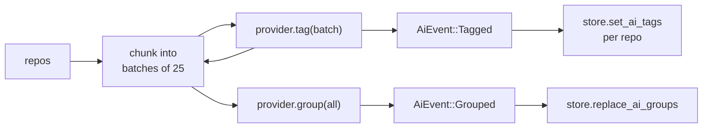

Tagging and grouping are optional. Starlet ships no key, runs no model on
launch, and shows an estimated cost before it starts. The reasoning is in
[ADR 9](/adr/byok-ai).

## Setting a key

Open **Settings** (`Cmd+,` / `Ctrl+,`), pick a provider, paste a key. Keys go to
the same OS keychain as the GitHub token, one entry per provider — service
`dev.starlet.starlet`, account `ai:{provider}` (`ProviderKeyStore`,
`crates/sync/src/auth.rs:239`).

| Provider id | Default model | Transport |
| --- | --- | --- |
| `openai` | `gpt-4o-mini` | `POST /v1/chat/completions`, `Authorization: Bearer`, native `response_format: {type: "json_object"}` |
| `anthropic` | `claude-3-5-haiku-latest` | `POST /v1/messages`, `x-api-key`, `anthropic-version: 2023-06-01`, `system` as a top-level field |
| `ollama` | `llama3.1` | `POST /api/chat`, no key, `format: "json"`, `options.temperature` |

The provider id is a frozen string: it is simultaneously the settings key, the
keychain account suffix, and the `provider_for` match arm
(`crates/ai/src/lib.rs:48`).

### Ollama

Ollama needs no key and costs nothing — `estimate()` always uses `Price::FREE`,
so USD is 0 while the token counts stay real so the UI can still show job size
(`crates/ai/src/ollama.rs:92`). It is also the only provider whose endpoint is
user-configurable:

```
Settings → endpoint → http://localhost:11434
```

Hosted providers keep their published origins on purpose, so a typo in a
settings field cannot exfiltrate a key (`crates/ui/src/analyze.rs:324-328`). If
you front a remote Ollama with a reverse proxy that wants a bearer token, set a
key and it will be attached; otherwise no `Authorization` header is sent at all.

## Running an analysis

Run **Analyze** from the command palette. Then:



- **Batch size is 25** (`BATCH_SIZE`, `crates/ai/src/analysis.rs:21`). Each
  batch is written to the store as it lands, so stopping mid-run keeps the work
  already paid for.
- **Grouping is deliberately unbatched.** Clustering needs to see the whole
  library at once, so `provider.group` gets every repository in one call.
- **One failing batch does not abort the run.** It emits `AiEvent::Failed`,
  increments a counter, and continues; the progress bar still reaches the total.
  Only *every* batch failing returns an error.
- **Cancellation is checked before each request**, never mid-flight — an
  in-flight request has already been paid for.

## The cost estimate is an upper bound

It is a labelled estimate, not a quote. The model in `crates/ai/src/cost.rs` is
deliberately pessimistic:

| Constant | Value |
| --- | --- |
| `CHARS_PER_TOKEN` | 4 |
| `TAG_INPUT_CHARS_PER_REPO` | 320 |
| `GROUP_INPUT_CHARS_PER_REPO` | 200 |
| `TAG_OUTPUT_TOKENS_PER_REPO` | 48 |
| `GROUP_OUTPUT_TOKENS_PER_REPO` | 12 |

```
batches = ceil(repos / 25)
input   = batches · ceil(len(TAG_SYSTEM)/4) + ceil(len(GROUP_SYSTEM)/4)
        + repos · (320 + 200) / 4
output  = repos · (48 + 12)
usd     = (input · input_per_M + output · output_per_M) / 1e6
```

Prices are looked up by **lowercased prefix match, first hit wins**
(`crates/ai/src/cost.rs:105`), so table order matters — `gpt-4o-mini` must
precede `gpt-4o`. An unknown model falls back to the most expensive tier in its
family (`2.50/10.00` for OpenAI, `3.00/15.00` for Anthropic), so a surprise is
always a pleasant one.

## Tag ownership

AI tags render muted. Keep one — **promote** it — and it becomes a user tag that
no later run will touch.

The guarantee is enforced in SQL, not in the UI: `set_ai_tags` reads the repo's
existing user-tag names, lowercased, and **skips any incoming AI tag whose name
is already a user tag** (`crates/store/src/taxonomy.rs:117-131`). See
[Database schema](/reference/database-schema#the-three-tag-sources).

::::note[Keys are redacted everywhere]
`ApiKey`'s hand-written `Debug` prints `ApiKey(redacted)`. Error bodies are
truncated to 512 characters and the literal key is replaced with `[redacted]`
first, because gateways echo the `Authorization` header back in a 401
(`crates/ai/src/client.rs:69`). A missing key is checked *before* the request,
so `AiError::MissingKey` never touches the network.
::::
