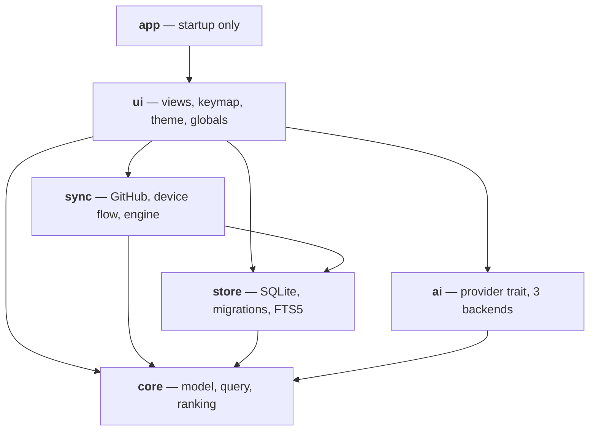

Starlet is one Cargo workspace with six member crates. The whole design rests on
one rule.

## The rule

**Dependencies point downward, and nothing below `ui` knows a window exists.**

What the rule buys, concretely:

| Crate | Absent dependency | What that makes possible |
| --- | --- | --- |
| `core` | no `sqlx`, `reqwest`, `gpui`, `tokio` | The query parser is `proptest`-able and the ranking formula is benchmarkable as a pure function. |
| `store` | no `reqwest`, `gpui` | Every behaviour under test lives in SQL, so tests run against a real in-memory SQLite with the real migrations. |
| `sync` | no `gpui` | 15 `wiremock` fixtures drive the real `SyncEngine` — media types, `Link` pagination, `If-None-Match`, GraphQL documents all exercised as in production. |
| `ai` | no `sqlx`, `gpui` | Three backends behind one trait, each with a `with_base_url` seam, so wire-level tests need no network. |
| `app` | no `core`, no `ai` | The binary genuinely cannot contain product logic. |

The rule also has a hard corollary: **`ui` must never touch SQLite or HTTP
directly.** Every I/O call goes through `Backend::spawn` /
`Backend::spawn_blocking`, and `runtime.block_on` appears in exactly one place —
`crates/app/src/main.rs`, before any window exists. See
[The runtime bridge](/architecture/runtime).

## What each crate owns

<CardGroup cols={2}>
  <Card title="core" href="/crates/core" icon="box">
    The `Repo` model, the query language, the ranking formula. Pure. No error
    type — `parse` is total.
  </Card>
  <Card title="store" href="/crates/store" icon="database">
    One SQLite file, one pool, the schema, the migrations, the FTS5 index. The
    only crate that knows SQL exists.
  </Card>
  <Card title="sync" href="/crates/sync" icon="refresh-cw">
    The only crate that talks to github.com. Device flow, keychain, six REST
    endpoints, two GraphQL documents, two sync algorithms.
  </Card>
  <Card title="ai" href="/crates/ai" icon="sparkles">
    The only crate that talks to a model provider. One trait, three backends, a
    tolerant JSON parser, an upper-bound cost model.
  </Card>
  <Card title="ui" href="/crates/ui" icon="monitor">
    Every interface decision. Two GPUI globals; everything else is an
    `Entity<T>` owned by the view that needs it.
  </Card>
  <Card title="app" href="/crates/app" icon="play">
    Logging, runtime, database, theme, keymap, globals, one window. Nothing
    else.
  </Card>
</CardGroup>

## Two globals, and no more

ADR 5 fixes the count at two. Both live in `crates/ui/src/services.rs`:

| Global | Type | Holds |
| --- | --- | --- |
| I/O backend | `Backend` (`services.rs:22`) | `Store` + `Arc<tokio::runtime::Runtime>` |
| Sign-in session | `Session` (`services.rs:98`) | `AuthStatus`, `Option<GitHub>`, `Option<Viewer>` |

Everything else is an `Entity<T>` owned by the view that needs it. `SearchView`
owns exactly three children — the input, the table, and the filter panel — plus
four `Task` handles and a `Vec<Subscription>`. Overlays are owned by the overlay
layer and hold a `WeakEntity<SearchView>` back-reference.

::::note[Prefer an entity to a global]
A new global is almost always the wrong answer. If a new startup step needs
shared state, ask first whether a view can own it — the answer has been yes
every time so far.
::::

## Read next

<CardGroup cols={2}>
  <Card title="The runtime bridge" href="/architecture/runtime" icon="cpu">
    How Tokio and GPUI meet, and the rule that keeps frames predictable.
  </Card>
  <Card title="Search pipeline" href="/architecture/search-pipeline" icon="search">
    A keystroke, end to end, through two ranking stages.
  </Card>
  <Card title="Sync pipeline" href="/architecture/sync-pipeline" icon="refresh-cw">
    Full vs incremental, the watermark, the count check.
  </Card>
  <Card title="Decisions" href="/adr" icon="scale">
    The eleven ADRs behind all of the above.
  </Card>
</CardGroup>
