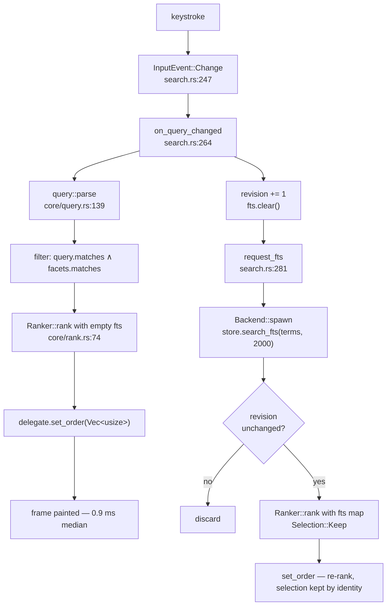

The search path never touches the network. It reads an in-memory `Vec<Arc<Repo>>`
snapshot plus one SQLite FTS query, and it is split into two stages so the first
one can paint a frame.

## The whole path



**Stage one is synchronous and paints the frame. Stage two runs on the I/O
runtime and re-ranks when it lands.** [ADR 3](/adr/two-stage-search) explains why
the three obvious alternatives — blocking the render thread, holding a second
synchronous connection, querying inside `render` — all lose.

## Stage one: parse and fuzzy rank

`query::parse` is **total**: it never fails and never panics, because it runs
against half-typed text on every keystroke. A half-typed prefix (`lang:`) is
skipped entirely rather than becoming a filter that matches nothing — that is
what stops the result list blanking mid-word. See
[Query syntax](/reference/query-syntax).

Filtering ANDs the parsed clauses (`Query::matches`) with the sidebar facets
(`FacetFilters::matches`, which is OR within a facet and AND across facets).
Free text is **never** used to filter — only to score.

Then `Ranker::rank` fuzzy-matches the query text against `full_name`, and
`full_name` only, using `nucleo`'s low-level `Matcher` and `Pattern`.
[ADR 4](/adr/nucleo-matcher-not-injector) covers why the threaded `Injector` API
is not used.

## Stage two: BM25

`store.search_fts(&terms, 2_000)` runs on the Tokio runtime against the
content-owning FTS5 table:

```sql
SELECT rowid, -bm25(repos_fts, 1.0, 5.0, 3.0, 4.0) AS rel
FROM repos_fts WHERE repos_fts MATCH ?
ORDER BY rel DESC LIMIT ?
```

Four weights, in table-declaration order: `full_name` **1.0**, `description`
**5.0**, `topics` **3.0**, `tags` **4.0**. `full_name` is weighted *down* on
purpose — the fuzzy half already owns that field with 70 % of the score, and
counting it twice would be the same evidence twice.

SQLite's `bm25()` is smaller-is-better, so the store negates it. Everything above
`store` sees bigger-is-better.

### Malformed input is not an error

`build_match` strips FTS5 syntax before it reaches SQLite: terms are filtered to
alphanumerics plus `_-./"`, trimmed of non-alphanumeric edges, and emitted as
`"term"*` joined by `AND`. So `OR`, `NEAR`, `-`, and `^` become data, not
operators.

And if SQLite still rejects the `MATCH` expression, the database error is logged
at debug level and swallowed into an empty map — the user is mid-keystroke, and a
dialog would be absurd (`crates/store/src/fts.rs:51-60`). Non-database errors
still propagate.

## The blend

$$\text{score} = 0.7\,f + 0.3\,t \qquad f = \frac{\text{fuzzy}}{\max \text{fuzzy}} \qquad t = \frac{\text{fts}}{\max \text{fts}}$$

Both maxima are taken over the **candidate set for this query**, never over the
corpus. Two consequences worth internalising:

1. **Scores are not comparable between queries.** You cannot threshold on
   `score` or compare results across searches.
2. **The crossover is exact.** A perfect name hit with no prose hit scores 0.70
   and beats a perfect prose hit with no name hit at 0.30.

A candidate with neither signal — no fuzzy match and no positive BM25 — is
**dropped entirely**, so `rank(...).len() <= repos.len()` whenever the query has
text. Callers must not assume a 1:1 mapping.

Full derivation, including tie-breaks and browse ordering, in
[Ranking](/reference/ranking).

## Row space vs data space

The table's `ResultsDelegate` holds two things:

| Field | Meaning |
| --- | --- |
| `repos: Arc<Vec<Arc<Repo>>>` | the **data space** — an immutable snapshot, replaced only when the store reloads |
| `order: Vec<usize>` | the **row space** — indices into `repos`, in display order |

A keystroke replaces `order` and nothing else. Row identity is the **repo id**,
not the row index (`crates/ui/src/results.rs:41-44`), which is why re-ranking
never moves hover or selection onto a different repository.

::::warning[`Scored.ix` indexes the exact slice you passed]
`Ranker::rank` returns `Scored { ix, .. }` where `ix` indexes the slice given to
it. Reordering or reallocating that slice between the call and consuming the
result silently mislabels every row.
::::

## Budgets

| Step | Median | Thread |
| --- | --- | --- |
| `query::parse` | free | application |
| Filter + fuzzy rank + sort, three clauses | 1.1 ms | application |
| Fuzzy rank + sort, worst-case one-character query | 0.9 ms | application |
| Browse ordering, empty query | 0.1 ms | application |
| FTS5 BM25 query | 3.4 ms | I/O runtime |

Guarded by `crates/core/tests/ranking_performance.rs` (10 ms budget, an order of
magnitude of headroom so a shared CI runner passes while an algorithmic
regression still fails) and `crates/store/tests/search_performance.rs` (60 ms
FTS, 800 ms full load — an N+1 guard, not a stopwatch).
