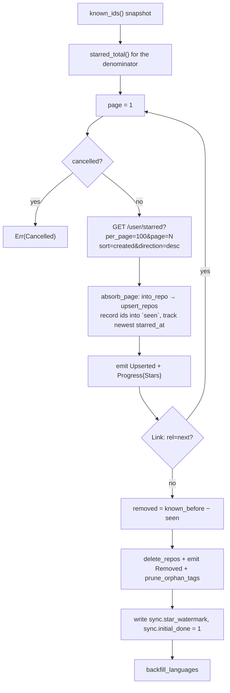
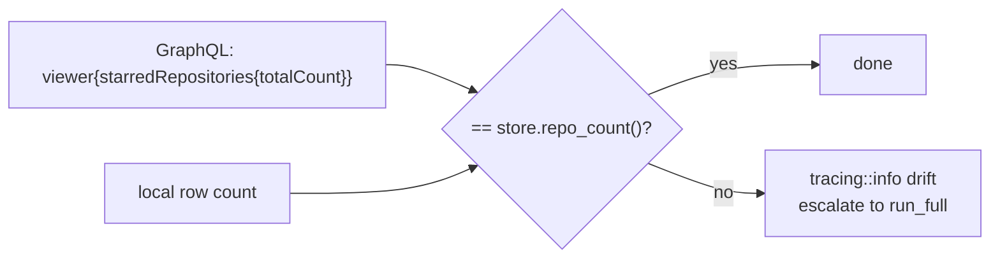

One engine, two algorithms, sharing one implementation. The design decisions are
in [ADR 8](/adr/incremental-sync).

## Schedule

`SYNC_INTERVAL = 15 min` (`crates/ui/src/search.rs:60`).
`schedule_background_sync` (`:462`) syncs once at launch if signed in, then loops
on `cx.background_executor().timer(15min)`; each tick skips if a sync is already
`Running`.

The cadence is **timer-checked rather than focus-event-driven**, so a window left
unfocused for a day does not queue a burst of syncs when it comes back.

Mode selection (`crates/ui/src/search.rs:509-513`): an explicit mode if the
caller gave one, otherwise `Full` when `SyncEngine::needs_full_sync` (i.e.
`sync.initial_done != "1"`), otherwise `Incremental`.

Nothing in `starlet-sync` knows about the schedule.

## Full sync



**A full listing is the only trustworthy unstar diff.** An incremental run cannot
detect unstars at all — hence the count check below.

::::warning[`Link: rel="next"` is the only end-of-list signal]
A full 100-item page does not imply another page exists
(`crates/sync/src/client.rs:431`).
::::

## Incremental sync

1. Read `sync.star_watermark`. Absent → delegate to `run_full` (and the summary
   returned is the full run's).
2. Page loop with `take_while(starred_at > watermark)`. The listing is
   `sort=created&direction=desc`, so **the first already-known star ends the
   scan**. An item with an absent or unparseable `starred_at` is treated as fresh.
3. Advance the watermark to the newest star seen.
4. `refresh_stale`, then `backfill_languages`.
5. **The count check.**

### The count check



One GraphQL point query catches every unstar without paging the whole list. If
the totals disagree, the run escalates to a full pass and adopts its `removed`
count. A `starred_total()` **error** is ignored rather than failing the run — the
reconciliation is skipped, and the next tick tries again.

## Conditional metadata refresh

`store.stale_ids(now - 24h)` returns `(id, full_name, etag)` oldest-first,
truncated to `REFRESH_BUDGET = 250` per run. Per item:

| Response | Effect |
| --- | --- |
| `304 Not Modified` | `touch_synced_at(id, now)` only. `metadata_refreshed` stays 0, no `Upserted` emitted, no quota spent. |
| `200` | Reload the row, convert, **restore `starred_at`**, `upsert_repos`, `set_etag`, count as refreshed. |
| `404` | `touch_synced_at` and leave the row. The repo may have gone private transiently; only a full sync removes rows. |
| `RateLimited` | Propagate immediately — the phase aborts. |
| anything else | `tracing::warn!` and continue to the next item. |

::::danger[A refresh must re-attach `starred_at`]
`GET /repos/{full_name}` does not return `starred_at`. `refresh_stale` reloads
the existing row and copies it back before upserting
(`crates/sync/src/engine.rs`). Losing it destroys the default browse ordering,
which is `sort:starred` descending. Guarded by
`a_modified_refresh_updates_metadata_and_keeps_the_star_date`
(`crates/sync/tests/sync.rs:406`).
::::

## Language backfill

`store.ids_without_languages(500)`, ordered by stargazers descending, chunked by
`GRAPHQL_BATCH = 25` into one aliased GraphQL document per chunk:

```graphql
r0: repository(owner: "…", name: "…") {
  databaseId
  languages(first: 20, orderBy: {field: SIZE, direction: DESC}) {
    edges { size node { name } }
  }
}
```

Results are matched by `databaseId`, **not by alias position**, because
`build_languages_query` skips names without a `/` and the alias indices are
therefore not dense.

A repo whose result is empty is skipped rather than written, which means a
genuinely language-less repository is retried on every run —
`ids_without_languages` matches `languages_json = '{}'`.

## Rate limiting

There is **no request-level retry**. Instead:

- Every response's `x-ratelimit-*` headers are absorbed into a
  `RateLimit { limit, remaining, reset_at }` shared by every clone of `GitHub`
  through an `Arc<Mutex<_>>`.
- Before every request, `respect_budget` checks it. Once
  `remaining <= RESERVE (50)` it **sleeps out the reset window** rather than
  erroring — the 50-request reserve keeps headroom for interactive detail-sheet
  fetches.
- A `403` or `429` becomes `SyncError::RateLimited { retry_after_secs, reset_at }`,
  which aborts the run and reaches the UI as `SyncEvent::Failed`.
- A `RateLimit::default()` — nothing observed yet — never blocks.

The `reqwest` client's 30 s timeout is the only other transport bound.

## Cancellation

An `Arc<AtomicBool>` from `cancel_flag()`, checked with `Ordering::Relaxed`:

| Location | On cancel |
| --- | --- |
| top of each star page | `return Err(Cancelled)` |
| top of each refresh item | **break** the loop — partial work is kept and the run reports success |
| top of each language chunk | **break**, same reasoning |

## Events

Progress leaves the engine as `SyncEvent` over an `UnboundedSender`:

```rust
Started(SyncMode)
Progress { phase: SyncPhase, done: usize, total: Option<usize> }
Upserted(Vec<Repo>)   // rows to reindex
Removed(Vec<i64>)
Finished(SyncSummary)
Failed(String)
```

**Every `events.send` result is discarded**, so a dropped receiver never blocks
or fails a sync. The UI drains the channel inside `cx.spawn` and applies each
event through `apply_sync_event` → `merge_repos` / `remove_repos` →
`publish_snapshot` → `rerank(Selection::Keep)`.

Note `Progress.total` is `Some(n)` during a full sync (from `starred_total`) and
`None` during an incremental one — the total genuinely is not known there.

## Lazily fetched data

Contributors and READMEs are **never** fetched during a sync. They are REST-only
and filled on detail-sheet open:

| Method | Cache |
| --- | --- |
| `SyncEngine::fetch_contributors(id, full_name)` | top 10, written to `contributors_json` |
| `SyncEngine::fetch_readme(id, full_name)` | 7-day cache via `store.readme(id, cutoff)` |

Both are on the interactive path, which is precisely what the 50-request rate
reserve protects.
