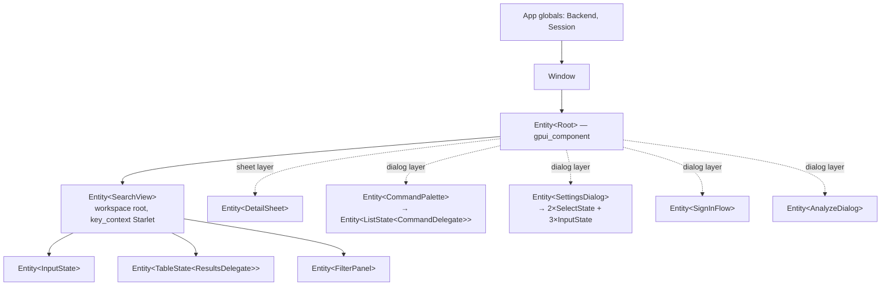

`starlet-ui` (lib `starlet_ui`, `crates/ui/src/lib.rs:1-7`) owns every interface
decision: the workspace layout, the results table, the sheet/dialog/notification
overlays, the keymap, the theme, the embedded assets, and the two process-wide
globals. It is the **only** crate that knows a window exists — everything below it
([`core`](/crates/core), [`store`](/crates/store), [`sync`](/crates/sync),
[`ai`](/crates/ai)) is written as if no UI were ever going to consume it.

The inverse is equally strict. `starlet-ui` never talks to SQLite, HTTP, or the
keychain directly. Every I/O touch goes through `Backend::spawn`
(`crates/ui/src/services.rs:47`) or `Backend::spawn_blocking`
(`crates/ui/src/services.rs:62`) onto the Tokio runtime, is awaited inside
`cx.spawn`, and is applied with `entity.update(cx, …)` + `cx.notify()`.

::::danger[Never block the frame]
There is no `block_on` anywhere in `crates/ui`. GPUI owns the main thread and the
frame budget; a synchronous `Store` call, a `GitHub` request, a keychain read, or
an `open::that_detached` on a view method stalls the window for as long as it
takes. The bridge and its three hops are specified in
[Runtime](/architecture/runtime); the rationale is
[ADR 5](/adr/tokio-runtime-bridge).
::::

## Modules

Fourteen public modules (`crates/ui/src/lib.rs:9-22`), organised by capability
rather than by role:

| Module | Role |
| --- | --- |
| `actions` | the 16 typed GPUI actions, the two key contexts, and `bind_keys` |
| `analyze` | the BYOK analysis dialog — cost confirmation, the run, per-batch persistence |
| `assets` | the embedded `AssetSource`, the two font-family consts, `load_fonts` |
| `brand` | the Starlet mark: one SVG path const and a sized `Svg` builder |
| `detail` | the 520 px repository detail sheet, with lazy contributor/README fill |
| `filters` | `FacetFilters` and the facet sidebar `FilterPanel` |
| `format` | pure display formatting — counts, relative and absolute dates, language hues |
| `palette` | the command palette: `Command` as data plus a `ListDelegate` |
| `results` | the table — column keys, `ResultsDelegate`, the row-space `order` vector |
| `search` | `SearchView`, the workspace root view and every action handler |
| `services` | the two globals, `Backend` and `Session`, and `AuthStatus` |
| `settings` | the 480 px settings dialog and the appearance key |
| `signin` | the GitHub App device-flow dialog and `sign_out` |
| `theme` | `Appearance`, the `ThemeSet` install, and the one correct switch point |

The crate root re-exports the surface `app` consumes — `Assets`, `SearchView`,
`AuthStatus`, `Backend`, `Session`, `Appearance` (`crates/ui/src/lib.rs:24-27`) —
plus two functions:

```rust crates/ui/src/lib.rs
pub fn init(appearance: Appearance, cx: &mut App)                          // lib.rs:35-45
pub fn workspace(window: &mut Window, cx: &mut App) -> Entity<SearchView>  // lib.rs:48-50
```

## The view tree



Ownership is not decorative here — it decides what dies with what.

- `SearchView` (`crates/ui/src/search.rs:77`) owns **exactly three** child
  entities (`crates/ui/src/search.rs:79-81`) plus four `Task` handles and a
  `Vec<Subscription>` (`crates/ui/src/search.rs:112-117`). The task handles live
  in `_`-prefixed fields (`_sync_task`, `_schedule_task`, `_fts_task`, `_task`)
  so the work dies when the view does.
- Overlay views are owned by the **overlay layer**, not by `SearchView`. When one
  needs to talk back it holds a `WeakEntity<SearchView>`
  (`crates/ui/src/palette.rs:130`, `crates/ui/src/analyze.rs:51`).
  `SettingsDialog` owns five component entities of its own
  (`crates/ui/src/settings.rs:57-61`).

::::warning[Overwriting `_task` cancels the previous one]
`crates/ui/src/analyze.rs:296` and `crates/ui/src/signin.rs:167` both assign into
the same `_task` field, which drops and therefore cancels whatever was running.
That is intentional for those two flows, and a trap the moment a third concurrent
task wants the same slot.
::::

## The two globals

Exactly two, both in `crates/ui/src/services.rs`. Everything else in the
interface is an `Entity<T>` owned by a view — see
[Architecture](/architecture) and [ADR 5](/adr/tokio-runtime-bridge).

### `Backend` — the I/O side

`pub struct Backend { runtime: Arc<tokio::runtime::Runtime>, store: Store }`
(`crates/ui/src/services.rs:22-25`), `impl Global` at
`crates/ui/src/services.rs:27`.

| Item | Signature | Cite |
| --- | --- | --- |
| `new` | `pub fn new(store: Store, runtime: Arc<Runtime>) -> Self` | `services.rs:30` |
| `global` | `pub fn global(cx: &App) -> &Backend` — panicking accessor | `services.rs:34` |
| `store` | `pub fn store(&self) -> Store` — cheap clone of the pool handle | `services.rs:38` |
| `spawn` | `pub fn spawn<F, T>(&self, future: F) -> oneshot::Receiver<T>` where `F: Future<Output = T> + Send + 'static, T: Send + 'static` | `services.rs:47-59` |
| `spawn_blocking` | `pub fn spawn_blocking<F, T>(&self, f: F) -> oneshot::Receiver<T>` where `F: FnOnce() -> T + Send + 'static, T: Send + 'static` — for synchronous APIs: keychain, `open::that_detached` | `services.rs:62-73` |

**Dropping the receiver detaches; it does not cancel.** That is the right default
for writes — a closed detail sheet must not roll back a tag edit that already
went out. Real cancellation is an explicit `AtomicBool`
(`crates/ui/src/analyze.rs:53`).

### `Session` — who is signed in

`pub struct Session { pub status: AuthStatus, pub github: Option<GitHub>, pub viewer: Option<Viewer> }`
(`crates/ui/src/services.rs:98-104`), `impl Global` at
`crates/ui/src/services.rs:106`.

| Item | Signature | Cite |
| --- | --- | --- |
| `AuthStatus` | `pub enum AuthStatus { SignedOut, Pending { user_code, verification_uri }, SignedIn, Failed(String) }` | `services.rs:76-89` |
| `AuthStatus::is_signed_in` | `pub fn is_signed_in(&self) -> bool` | `services.rs:92` |
| `restore` | `pub fn restore() -> Self` — synchronous keychain read at startup | `services.rs:113` |
| `signed_out` | `pub fn signed_out() -> Self` | `services.rs:131` |
| `global` | `pub fn global(cx: &App) -> &Session` | `crates/ui/src/services.rs` |
| `is_signed_in` | `pub fn is_signed_in(cx: &App) -> bool` | `crates/ui/src/services.rs` |
| `client` | `pub fn client(cx: &App) -> Option<GitHub>` — cloned client for sync and detail fetches | `crates/ui/src/services.rs` |

`restore` is the one deliberate synchronous keychain call in the product: it costs
a single local-daemon round trip, and it decides what the first frame renders, so
deferring it would mean painting the welcome screen and then retracting it.

## Actions and keybindings

Commands are typed GPUI actions — `actions!(starlet, [...])` at
`crates/ui/src/actions.rs:16-41` produces 16 unit structs — dispatched
identically from the keyboard, the toolbar, and the palette. They are scoped by
two key contexts: `CONTEXT = "Starlet"` (`crates/ui/src/actions.rs:11`) and
`RESULTS_CONTEXT = "StarletResults"` (`crates/ui/src/actions.rs:14`). All
bindings live in one function, `bind_keys` (`crates/ui/src/actions.rs:45`).

| Action | Chord | Context | Handler |
| --- | --- | --- | --- |
| `ToggleCommandPalette` | `cmd-k` *(macOS)* / `ctrl-shift-p` *(elsewhere)* | `Starlet` | `search.rs:723` |
| `ToggleSidebar` | `secondary-b` | `Starlet` | `search.rs:716` |
| `OpenSettings` | `secondary-,` | `Starlet` | `search.rs:732` |
| `SyncNow` | `secondary-r` | `Starlet` | `search.rs:736` |
| `FocusSearch` | `secondary-f` | `Starlet` | `search.rs:687` |
| `CopyUrl` | `secondary-c` | `Starlet` **and** `Input` | `search.rs:442` |
| `Dismiss` | `escape` | `Starlet` | `search.rs:691` |
| `SelectPrev` | `up`, `ctrl-k` | `Starlet`, `Input`, `StarletResults` | `search.rs:397` (−1) |
| `SelectNext` | `down`, `ctrl-j` | `Starlet`, `Input`, `StarletResults` | `search.rs:397` (+1) |
| `SelectFirst` | `secondary-up` | `Starlet` | `search.rs:410` |
| `SelectLast` | `secondary-down` | `Starlet` | `search.rs:410` |
| `OpenInBrowser` | `enter` | `Starlet`, `StarletResults` | `search.rs:422` |
| `ShowDetail` | `space` | `StarletResults` **only** | `search.rs:449` |
| `CycleFocus` | `tab` | `Starlet`, `Input`, `StarletResults` | `search.rs:672` |
| `Analyze` | *(no chord — palette or menu)* | `Starlet` | `search.rs:744` |
| `SignOut` | *(no chord — toolbar or palette)* | `Starlet` | `search.rs:748` |

`tab`, `up`, `down` and `secondary-c` are **re-registered** on
`gpui_component`'s own `Input` context (`crates/ui/src/actions.rs:85-94`). A
binding on an ancestor context never beats one on the focused node, and
registration order decides the winner between equals — `gpui_component::init` has
already run by the time `bind_keys` does, so Starlet's registration wins. This is
only safe because Starlet has no multi-line text entry.

### Platform divergence

`ToggleCommandPalette` is bound by a `#[cfg(target_os = "macos")]` /
`#[cfg(not(target_os = "macos"))]` pair on adjacent `KeyBinding::new` entries
inside the same `cx.bind_keys([...])` array (`crates/ui/src/actions.rs:53-56`).

The reason is not brand convention. GPUI's `secondary-` modifier is Cmd on macOS
but **Ctrl** everywhere else, so a single `secondary-k` binding would resolve to
`ctrl-k` on Linux and Windows — the chord already bound to `SelectPrev`. Nothing
would warn: the later registration simply wins and selection-up stops working.
Hence `cmd-k` on macOS and `ctrl-shift-p` elsewhere. See
[ADR 11](/adr/platform-keybindings) and [Keybindings](/reference/keybindings).

### Labels are read back out of the keymap

No shortcut label is hard-coded anywhere. Both places that show a chord ask the
**live keymap** what is actually bound:

- the toolbar, via
  `Kbd::binding_for_action(&ToggleCommandPalette, Some(actions::CONTEXT), window)`
  (`crates/ui/src/search.rs:849-852`), wrapped in `when_some` so an unbound action
  renders no button at all;
- each palette row, via
  `Kbd::binding_for_action(action.as_ref(), Some(actions::CONTEXT), window)`
  (`crates/ui/src/palette.rs:193`), fed by
  `Command::bound_action() -> Option<Box<dyn gpui::Action>>`
  (`crates/ui/src/palette.rs:76-83`).

A row therefore cannot advertise a chord this platform does not bind, and the
`#[cfg]` pair above needs no parallel `#[cfg]` in the rendering code.

::::note[Documentation drift, verified]
[ADR 11](/adr/platform-keybindings) states that the toolbar label comes from "a
single `command_palette_shortcut()` function". **No such function exists in the
codebase.** A repository-wide grep finds only the ADR sentence itself and a stale
comment at `crates/ui/src/actions.rs:52`. The real mechanism is
`Kbd::binding_for_action`, called at `crates/ui/src/search.rs:849` and
`crates/ui/src/palette.rs:193`. Trust the two call sites, not the ADR prose.
::::

## The results table

```rust crates/ui/src/results.rs
pub const COL_NAME / COL_DESCRIPTION / COL_LANGUAGE
        / COL_STARS / COL_LAST_COMMIT / COL_TAGS: &str            // results.rs:26-31

pub struct SortRequest { pub column: &'static str, pub sort: ColumnSort }  // results.rs:35-38
pub struct ResultsDelegate { … }                                  // results.rs:40
```

| Method | Cite |
| --- | --- |
| `pub fn new() -> Self` (plus `impl Default`) | `results.rs:53` |
| `pub fn set_repos(&mut self, repos: Arc<Vec<Arc<Repo>>>)` | `results.rs:64` |
| `pub fn set_order(&mut self, order: Vec<usize>)` | `results.rs:69` |
| `pub fn set_loading(&mut self, loading: bool)` | `results.rs:73` |
| `pub fn repo_at(&self, row: usize) -> Option<&Arc<Repo>>` | `results.rs:78` |
| `pub fn take_sort_request(&mut self) -> Option<SortRequest>` | `results.rs:82` |
| `pub fn column_widths(&self) -> Vec<f32>` | `results.rs:87` |
| `pub fn set_column_widths(&mut self, widths: &[f32])` | `results.rs:93` |
| `pub fn set_sort_indicator(&mut self, column: &str, sort: ColumnSort)` | `results.rs:100` |

The delegate holds an immutable `Arc<Vec<Arc<Repo>>>` snapshot — the **data
space** — and a `Vec<usize>` of indices into it — the **row space**
(`crates/ui/src/results.rs:41-44`). A keystroke replaces only the order vector
(`crates/ui/src/results.rs:69`), so re-ranking allocates one small vector and
copies no row data. The full derivation is in
[Row space vs data space](/architecture/search-pipeline#row-space-vs-data-space).

Row identity is keyed by the repository id, not the row index
(`crates/ui/src/results.rs`), so a re-rank can never slide hover or selection onto
a different repository.

Three rules worth knowing before you touch it:

- **Persisted widths are validated.** `set_column_widths`
  (`crates/ui/src/results.rs:93-98`) accepts `40.0..=1200.0`, rejects NaN, and
  zips — so a short array from an older saved layout leaves the tail columns
  alone rather than truncating them.
- **The sort indicator is exclusive** (`crates/ui/src/results.rs:100`): setting it
  on one column clears every other.
- **A `sort:` prefix in the query outranks a header click**
  (`crates/ui/src/search.rs:327-331`). `perform_sort` only *records* the intent;
  `SearchView` drains it with `take_sort_request` and may discard it.

`pub fn language_dot(language: &str) -> Div` (`crates/ui/src/results.rs`) is the
consumer of the crate's one sanctioned colour literal — see
[Theme and assets](#theme-and-assets).

## Facets

```rust crates/ui/src/filters.rs
pub struct FacetFilters { pub tags: BTreeSet<String>, pub groups: BTreeSet<String> }  // :26-29
pub fn matches(&self, repo: &Repo) -> bool         // :36
pub fn is_empty(&self) -> bool                     // :42
pub struct FilterPanel { … }                       // :47
impl EventEmitter<FacetFilters> for FilterPanel    // :53
```

`matches` is **OR within a facet, AND across facets**
(`crates/ui/src/filters.rs:36`): two selected tags widen the result set, a
selected tag plus a selected group narrows it. That is the behaviour a facet
sidebar is expected to have, and it is why both fields are `BTreeSet` —
deterministic iteration keeps the emitted event comparable.

`FilterPanel` does not mutate the workspace. It **emits `FacetFilters` as a GPUI
event** (`crates/ui/src/filters.rs:53`) and `SearchView` subscribes, which keeps
the sidebar independently testable and stops it from needing a back reference.

`reload` (`crates/ui/src/filters.rs:71`) rebuilds the lists from
`tag_facets`/`group_facets`, capped at **40 tags**, then:

- merges same-named facets across sources **case-insensitively** and drops
  singletons (`crates/ui/src/filters.rs`) — a facet that selects exactly one
  repository is a worse affordance than no facet at all;
- prunes selections that no longer exist (`crates/ui/src/filters.rs:94`), so a tag
  removed by a re-analysis cannot silently empty the result list with no visible
  cause.

`active` is at `crates/ui/src/filters.rs:66` and `clear` at
`crates/ui/src/filters.rs:117`.

### `sidebar_choice`

`SearchView::is_sidebar_open` is `sidebar_choice.unwrap_or(!is_home())`
(`crates/ui/src/search.rs:783`). The field is `Option<bool>`: `None` means *follow
the query* — the sidebar arrives with results and leaves with them — and `Some` is
a decision the user pinned for this session, which the query never overrides
again. Two tests pin both halves (`crates/ui/tests/workspace.rs:432`, `:457`).

## Overlays

| Overlay | Surface | Entry point | Cite |
| --- | --- | --- | --- |
| `DetailSheet` | sheet, 520 px | `pub fn open(repo: Arc<Repo>, window, cx)` → `window.open_sheet(…)` | `detail.rs:39`, `:48-54` |
| `SettingsDialog` | dialog, 480 px | `pub fn open(window, cx)` → `window.open_dialog(…)` | `settings.rs:56`, `:70-76` |
| `SignInFlow` | dialog, 420 px | `pub fn start(window, cx)`; `pub fn sign_out(cx)` | `signin.rs:38`, `:45`, `:67` |
| `AnalyzeDialog` | dialog, 460 px | `pub fn open(owner: Entity<SearchView>, window, cx)` | `analyze.rs:50`, `:61` |
| `CommandPalette` | dialog, 560 px, `close_button(false)` | `pub fn toggle(owner: Entity<SearchView>, window, cx)` | `crates/ui/src/palette.rs` |

`DetailSheet` fills contributors and the README lazily over the network and
degrades to `Fetch::Empty` when signed out (`crates/ui/src/detail.rs:74`);
`promote_tag` writes through at `crates/ui/src/detail.rs:301`. Its `Render` must
resolve `render_tags` — which needs `&mut Context` — **before** the read-only
renderers, or the borrows overlap (`crates/ui/src/detail.rs:410-418`).

`SettingsDialog` writes each field on change, with one exception: the API key goes
to the OS keychain on `InputEvent::Blur` only
(`crates/ui/src/settings.rs:269-293`), never per keystroke and **never to
SQLite**. The endpoint field is shown only for the local Ollama provider — hosted
providers keep their published origins so a typo cannot exfiltrate a key
(`crates/ui/src/analyze.rs`). `SignInFlow` never holds the token in view state and
never logs it (`crates/ui/src/signin.rs:4-6`).

::::warning[`Root` renders only its child]
`gpui_component::Root` does **not** render the sheet, dialog and notification
layers for you. They are static helpers the application root composes itself, in
stacking order sheet → dialog → notification
(`crates/ui/src/search.rs:1131-1133`). Omit them and the failure mode is uniquely
misleading: every command fires, every state update lands, every assertion on view
state passes — and nothing is visible. `crates/ui/tests/overlays.rs` exists for
precisely this, asserting through `window.has_active_dialog` /
`has_active_sheet` rather than through view state.
::::

## The command palette

`Command` (`crates/ui/src/palette.rs:27-41`) is **data**, not behaviour:

```rust crates/ui/src/palette.rs
pub enum Command {
    Sort(SortKey), Filter { label, query }, Sync, Analyze, Settings,
    ToggleSidebar, ClearFilters, Appearance(Appearance), SignIn, SignOut,
}
```

Four projections hang off it — `label` (`:44-59`), `query_hint` (`:65-69`),
`bound_action` (`:76-83`, which is what lets the row show its real chord) and
`group` (`:85-92`). `all_commands(signed_in)` (`crates/ui/src/palette.rs:95`)
assembles the list and gates the session-dependent entries on the flag.
`CommandDelegate` (`crates/ui/src/palette.rs:129`, `impl ListDelegate` at `:148`)
does fuzzy substring search over label + group; `confirm`
(`crates/ui/src/palette.rs:248`) closes the dialog and then calls `run`.

`run` (`crates/ui/src/palette.rs:265`) takes exactly one of two routes:

1. mutate the workspace through the `WeakEntity<SearchView>` — `Sort`, `Filter`,
   `ClearFilters`;
2. **re-dispatch the real action** with `window.dispatch_action(Box::new(…), cx)`.

Route 2 is the point. A palette entry for `SyncNow` runs the same handler the
`secondary-r` chord runs, so there is exactly one implementation per command and
no way for the palette and the keyboard to drift apart.

`CommandPalette::toggle` closes the topmost dialog if one is already open, which
is what makes the toggle symmetric (`crates/ui/tests/overlays.rs:90`).

## Theme and assets

Styling is entirely token-driven — [ADR 10](/adr/theme-as-tokens).

`crates/ui/src/theme/starlet.json` is `include_str!`-ed at
`crates/ui/src/theme.rs:15` and deserialised into a `gpui_component::ThemeSet` at
`crates/ui/src/theme.rs:45`. It holds exactly **two** `ThemeConfig` documents —
`"Starlet Dark"` with `is_default: true`, and a light twin — each carrying
`font.size: 14`, `radius: 6`, `radius.lg: 6`, `shadow: false` and a flat map of
dotted colour tokens: `background #0a0a0a`, `foreground #fafafa`,
`border #262626`, `muted.foreground #a1a1aa`, plus `ring`, `caret`,
`overlay #0a0a0acc`, `window.border`, `accent.*`, `primary.*` (with `.hover` and
`.active`), `secondary.*`, `popover.*`, `input.border`, `selection.background`,
`list.*` and `table.*` (`crates/ui/src/theme/starlet.json:1-43`).

Views read `cx.theme().<token>` and **never name a hex value**. The single audited
exception is `format::language_color` (`crates/ui/src/format.rs:61`) — Linguist
hues with an FNV-derived fallback at `crates/ui/src/format.rs:106` — used by
`results::language_dot` and the language bar, because there the hue *is* the
datum rather than a styling choice.

| Item | Signature | Cite |
| --- | --- | --- |
| `Appearance` | `pub enum Appearance { Dark, Light, System }`, `Dark` is `Default` | `theme.rs:19-26` |
| `Appearance::label` | `pub fn label(self) -> &'static str` → `"Dark"` / `"Light"` / `"Match system"` | `theme.rs:29` |
| `Appearance::ALL` | `pub const ALL: [Appearance; 3]` | `theme.rs:37` |
| `install` | `pub fn install(appearance: Appearance, fonts_loaded: bool, cx: &mut App)` | `theme.rs:44` |
| `apply` | `pub fn apply(appearance: Appearance, window: Option<&mut Window>, cx: &mut App)` | `theme.rs:75` |

`install` walks `set.themes` and replaces `theme.dark_theme` / `theme.light_theme`
by `config.mode.is_dark()` (`crates/ui/src/theme.rs:52-60`), calls `apply`, and
then — **only if fonts loaded** — sets `theme.font_family = "Geist"` and
`theme.mono_font_family = "Geist Mono"` (`crates/ui/src/theme.rs:68-72`).

`apply` is the **only correct switch point**. Changing the appearance by any other
route leaves the UI half-restyled, because `Theme::change` is what reprojects the
scrollbar and resize handles. `settings::set_appearance`
(`crates/ui/src/settings.rs:26`) applies through it and *then* persists;
`settings::parse_appearance` (`crates/ui/src/settings.rs:41`) defaults an unknown
stored value to `Dark`.

### Embedded assets

`crates/ui/build.rs` walks `crates/ui/assets/` recursively, collects `(key, path)`
pairs, **sorts** them for a deterministic build, and writes
`OUT_DIR/embedded_assets.rs` containing

```rust OUT_DIR/embedded_assets.rs (generated)
pub static EMBEDDED: &[(&str, &[u8])] = &[ /* one include_bytes! per file */ ];
```

Keys are joined with **forward slashes** on every platform
(`crates/ui/build.rs:39-45`), because they are compared against the POSIX asset
paths `gpui-component` hard-codes — a Windows build that emitted backslashes
would compile cleanly and then fail to find a single icon at runtime. The script
emits `cargo:rerun-if-changed` on the assets directory
(`crates/ui/build.rs:14`), and `crates/ui/src/assets.rs:7` pulls the table in with
`include!(concat!(env!("OUT_DIR"), "/embedded_assets.rs"))`.

The tree is three directories:

<FileTree>
- assets
  - brand
    - starlet.svg
  - icons
    - 86 Lucide `*.svg` files, vendored from `gpui-component`'s repository at the matching tag because the **published crate ships none**
  - fonts
    - Geist-Regular.ttf, Geist-Medium.ttf, Geist-SemiBold.ttf
    - GeistMono-Regular.ttf, GeistMono-Medium.ttf
    - OFL.txt, LICENSE.txt — skipped by the `.ttf` filter in `load_fonts`
</FileTree>

`impl AssetSource for Assets` (`crates/ui/src/assets.rs:13-29`) strips a leading
`/` before matching (`crates/ui/src/assets.rs:14`), which is why both
`icons/search.svg` and `/icons/search.svg` resolve. `UI_FONT` and `MONO_FONT` are
at `crates/ui/src/assets.rs:32` and `:34`; `load_fonts`
(`crates/ui/src/assets.rs:41`) registers every `fonts/*.ttf` with the text system
(`crates/ui/src/assets.rs:44`). The net effect is a single self-contained
executable with no asset directory to ship.

## Ordering constraints

Startup is order-sensitive in five places, and focus in two. All of it is cheap to
get wrong and expensive to debug.

1. **`gpui_component::init(cx)` must run before `starlet_ui::init`**
   (`crates/ui/src/lib.rs:32-34`, `crates/app/src/main.rs:70-71`,
   `crates/ui/src/theme.rs:41-43`). The latter mutates the `Theme` global the
   former creates, and extends its key contexts.
2. **Inside `init`, the order is fonts → theme → keys**
   (`crates/ui/src/lib.rs:36-44`). It is a dependency order, not a preference.
3. **The Geist families are claimed only if `load_fonts` succeeded**
   (`crates/ui/src/theme.rs:68-72`), so a font failure degrades to the platform UI
   font instead of requesting a family that was never registered.
4. **Both globals are set before the window opens.** `SearchView::new` calls
   `Backend::global` on the very first frame (`crates/app/src/main.rs:73-74`, then
   `:78`).
5. **`gpui_component::Root` must be the first-level view of every window**
   (`crates/app/src/main.rs:79-82`, and `crates/ui/tests/workspace.rs:80-88` in
   tests). The overlay layers resolve through it.

Two focus traps:

- **Focus set during `SearchView::new` is discarded** when the window installs its
  own initial focus. The fix already in place is `cx.defer_in(window, …)`
  (`crates/ui/src/search.rs`).
- **`Enter` in the input arrives as `InputEvent::PressEnter`, not as an action**
  (`crates/ui/src/search.rs:255-259`), so handling `OpenInBrowser` alone will not
  see it. Relatedly, `Space` is `ShowDetail` only in `RESULTS_CONTEXT` — in the
  input it is a literal character (`crates/ui/src/actions.rs:83`) — which makes
  `Tab`/`CycleFocus` (`crates/ui/src/search.rs:672`) the only keyboard route to
  the sheet.

## Tests

22 integration tests, all `#[gpui::test]`, all through a real headless test window
with an in-memory `Store` and a 1-worker Tokio runtime. The recipe — and why
`run_until_parked()` alone is insufficient — is in
[Testing](/development/testing).

`crates/ui/tests/workspace.rs` (17). Helpers: `repo()` `:19`, `boot_signed_out()`
`:38`, `boot()` `:100`, `settle()` `:107`, `wait_for()` `:114`.

| Test | Cite |
| --- | --- |
| the workspace opens at home with every repository loaded | `:135` |
| a signed-out launch opens on the sign-in screen | `:150` |
| the sign-in screen can be dismissed to search the local mirror | `:166` |
| signing in replaces the welcome screen | `:186` |
| signing out brings the welcome screen back — dismissal is per session | `:202` |
| typing shifts the layout and narrows the results | `:216` |
| a prefix filters without matching as text (`stars:>47500` ⇒ 2) | `:236` |
| a description-only match is found through the FTS index — proves stage two | `:252` |
| arrow keys move the highlight and clamp at both ends, with no wrap | `:270` |
| a new query resets the highlight to the top | `:322` |
| Escape with no overlay clears the query and returns home | `:345` |
| `CopyUrl` writes the highlighted repository's URL to the clipboard | `:364` |
| Tab hands the keyboard to the table and back | `:384` |
| Tab does nothing when the table is empty | `:413` |
| filters come into view with the results and leave with them | `:432` |
| an explicit sidebar toggle outranks the query for the rest of the session | `:457` |
| the sidebar toggles | `:482` |

`crates/ui/tests/overlays.rs` (5). Helpers: `boot()` `:24`, `settle()` `:73`,
`has_dialog()` `:81`, `has_sheet()` `:85`.

| Test | Cite |
| --- | --- |
| the command palette opens and closes — symmetric toggle | `:90` |
| Settings opens as a dialog | `:105` |
| the detail sheet opens for the highlighted repository | `:113` |
| Escape dismisses the sheet before touching the query, then clears the query | `:126` |
| Escape closes a dialog before touching the query | `:151` |

Plain in-module `#[test]`s cover the pure parts, and there are more of them than
of the window tests: the theme parses and covers both modes, plus the dark surface
tokens, `radius 6` and `shadow false` (`crates/ui/src/theme.rs:89`, `:97`); more
than 60 icons and seven named ones are embedded, both font families are present,
and load is path-normalised (`crates/ui/src/assets.rs:55`, `:79`, `:90`); the
order vector is the row space, widths round-trip and reject nonsense, a short
layout leaves the rest alone, and the sort indicator is exclusive
(`crates/ui/src/results.rs`); six formatting tests
(`crates/ui/src/format.rs:136`, `:147`, `:160`, `:169`, `:178`, `:191`); facet
merge across sources with singleton drop, empty matches everything, and
tags-OR/facets-AND (`crates/ui/src/filters.rs`); a bounded README preview with
comments dropped (`crates/ui/src/detail.rs:444`); every sort key round-tripping
through `query::parse`, the account command following the session, and every
filter shortcut parsing to a clause with no leaked free text
(`crates/ui/src/palette.rs`); appearance defaulting to dark and labels
round-tripping (`crates/ui/src/settings.rs`); and the four provider-guard tests at
`crates/ui/src/analyze.rs:512`, `:518`, `:525`, `:531`. There is no proptest, no
wiremock and no insta in this crate.

## Extension points

A whole new view — [Add a view](/guides/add-a-view).

<Accordion>
<AccordionItem title="A new action and keybinding">
Add the variant to `actions!` (`crates/ui/src/actions.rs:16-41`); add a
`KeyBinding::new(...)` in `bind_keys` (`crates/ui/src/actions.rs:46-96`), choosing
`CONTEXT` for global or `RESULTS_CONTEXT` for table-only, and a
`#[cfg(target_os = …)]` pair if `secondary-` would collide; write the handler
`fn my_action(&mut self, _: &MyAction, window: &mut Window, cx: &mut Context<Self>)`
on `SearchView` near `crates/ui/src/search.rs:716-750`; register it with
`.on_action(cx.listener(Self::my_action))` in the render chain at
`crates/ui/src/search.rs:1064-1081`; import it in the `use crate::actions::{…}`
list at `crates/ui/src/search.rs:43-47`.
</AccordionItem>

<AccordionItem title="A new table column">
Add a `pub const COL_X: &str` (`crates/ui/src/results.rs:26-31`); add a
`Column::new(COL_X, "X")` to `default_columns` (`crates/ui/src/results.rs`), with
`.sortable()` if it maps to a sort key; render it in the `match key.as_ref()` of
`render_td` (`crates/ui/src/results.rs`); if sortable, allow it in
`perform_sort`'s key whitelist (`crates/ui/src/results.rs`) and map it to a
`SortKey` in `SearchView::apply_sort_request`
(`crates/ui/src/search.rs:644-653`). Persisted widths degrade gracefully —
`set_column_widths` zips, so an older saved layout is fine
(`crates/ui/src/results.rs:93-98`).
</AccordionItem>

<AccordionItem title="A new setting">
Add a `pub const KEY_…` beside `KEY_APPEARANCE` (`crates/ui/src/settings.rs:23`)
or reuse an existing `starlet_store::KEY_*`; add the control entity to
`SettingsDialog` (`crates/ui/src/settings.rs:56-67`); construct it in `new`
(`crates/ui/src/settings.rs:78-128`); subscribe in the `subscriptions` vec
(`crates/ui/src/settings.rs:105-111`); read it in `load`
(`crates/ui/src/settings.rs:130-180`); write it in an `on_*_changed` handler
(pattern at `crates/ui/src/settings.rs:232-247` — use `InputEvent::Blur`, not
`Change`, for a secret, as at `crates/ui/src/settings.rs:270`); render it via
`field(...)` in `Render` (`crates/ui/src/settings.rs`).
</AccordionItem>

<AccordionItem title="A new theme token, or a light/dark tweak">
Edit `crates/ui/src/theme/starlet.json` — **both** theme objects — and read it in
views as `cx.theme().<token>`. Never introduce a literal colour; the only
sanctioned exception is `crates/ui/src/format.rs:61`. The unit test at
`crates/ui/src/theme.rs:97` asserts the four surface colours, `radius` and
`shadow`, so a structural change to the JSON fails there first.
</AccordionItem>

<AccordionItem title="A new asset (icon or font)">
Drop the file under `crates/ui/assets/<icons|fonts|brand>/`; `build.rs` picks it
up on the next build through `rerun-if-changed` (`crates/ui/build.rs:14`).
Reference it by its **forward-slash** relative path. A `.ttf` under `fonts/` is
auto-registered (`crates/ui/src/assets.rs:44`). If `gpui-component` itself needs
the icon, add it to the required list at `crates/ui/src/assets.rs:63-71`.
</AccordionItem>

<AccordionItem title="A new async data path in a view">
Always the same three hops:
`let rx = Backend::global(cx).spawn(async move { … });` then
`cx.spawn(async move |this, cx| { let Ok(v) = rx.await else { return }; let _ = this.update(cx, |this, cx| { …; cx.notify() }); })`.
Store the `Task` in a `_`-prefixed field to tie its lifetime to the view, or
`.detach()` for fire-and-forget. Canonical examples:
`crates/ui/src/search.rs:189-199` (detached read),
`crates/ui/src/search.rs:281-303` (revision-guarded),
`crates/ui/src/filters.rs:71-91`. **If the result depends on the query you must
capture and re-check `self.revision`** (`crates/ui/src/search.rs:288`, `:295`) or
a slow answer for an older query will overwrite a newer one.
</AccordionItem>
</Accordion>
