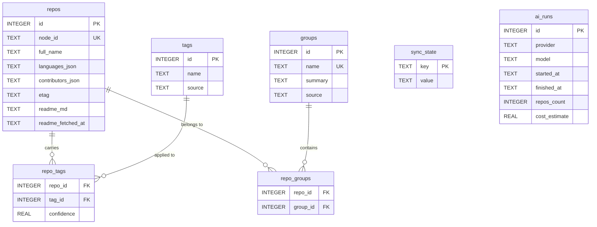

There is exactly one migration, `crates/store/migrations/0001_init.sql`, and it
creates the whole schema. Two conventions hold throughout: **every timestamp is
`TEXT` holding RFC 3339 in UTC**, so the file stays readable from the `sqlite3`
CLI, and **JSON columns are round-tripped, never queried structurally** — they
hold shapes GitHub already returns as JSON
(`crates/store/migrations/0001_init.sql:1-5`).

Seven real tables and one FTS5 virtual table. `repos_fts` is not in the diagram
below because it is a virtual table with no declared foreign keys; its `rowid`
is bound to `repos.id` by trigger, which the diagram cannot express.



`repo_tags` and `repo_groups` each have a **composite** primary key over their
two foreign keys, which the diagram renders as plain `FK` columns.

## repos

The local mirror. One row per starred repository
(`crates/store/migrations/0001_init.sql:7-31`).

| Column | Type | Notes |
| --- | --- | --- |
| `id` | `INTEGER PRIMARY KEY` | GitHub's numeric repository id. Stable across renames, and also `repos_fts.rowid` |
| `node_id` | `TEXT NOT NULL UNIQUE` | GraphQL node id |
| `full_name` | `TEXT NOT NULL` | `owner/name` |
| `name` | `TEXT NOT NULL` | |
| `owner` | `TEXT NOT NULL` | |
| `html_url` | `TEXT NOT NULL` | |
| `description` | `TEXT` | nullable; the highest-weighted FTS column |
| `stargazers` | `INTEGER NOT NULL DEFAULT 0` | |
| `last_commit_at` | `TEXT` | GitHub's `pushed_at` |
| `primary_language` | `TEXT` | |
| `languages_json` | `TEXT NOT NULL DEFAULT '{}'` | `'{}'` means **not backfilled yet**, not "no languages" |
| `contributors_json` | `TEXT` | `NULL` means never fetched |
| `starred_at` | `TEXT` | |
| `archived` | `INTEGER NOT NULL DEFAULT 0` | boolean |
| `fork` | `INTEGER NOT NULL DEFAULT 0` | boolean |
| `topics_json` | `TEXT NOT NULL DEFAULT '[]'` | |
| `updated_at` | `TEXT` | |
| `synced_at` | `TEXT` | local bookkeeping; drives staleness |
| `etag` | `TEXT` | conditional-request validator for the 24 h metadata refresh (`0001_init.sql:26-27`) |
| `readme_md` | `TEXT` | README cache |
| `readme_fetched_at` | `TEXT` | drives the 7-day README expiry (`0001_init.sql:28-30`) |

Six indexes (`crates/store/migrations/0001_init.sql:33-38`):

| Index | Columns |
| --- | --- |
| `idx_repos_full_name` | `full_name` |
| `idx_repos_owner` | `owner` |
| `idx_repos_language` | `primary_language` |
| `idx_repos_stargazers` | `stargazers DESC` |
| `idx_repos_starred_at` | `starred_at DESC` |
| `idx_repos_synced_at` | `synced_at` |

## tags

`crates/store/migrations/0001_init.sql:40-46`.

| Column | Type | Notes |
| --- | --- | --- |
| `id` | `INTEGER PRIMARY KEY` | |
| `name` | `TEXT NOT NULL` | |
| `source` | `TEXT NOT NULL` | `'github'`, `'ai'` or `'user'` — a comment, **not** a `CHECK` constraint (`:43`) |

The uniqueness constraint is `UNIQUE (name, source)` (`:45`), per **source**.
The same word produced by all three sources is therefore **three rows**, and a
name collision between a user tag and an AI tag is resolved at write time by
`set_ai_tags`, not by the schema.

## repo_tags

`crates/store/migrations/0001_init.sql:48-53`.

| Column | Type | Notes |
| --- | --- | --- |
| `repo_id` | `INTEGER NOT NULL` | `REFERENCES repos (id) ON DELETE CASCADE` |
| `tag_id` | `INTEGER NOT NULL` | `REFERENCES tags (id) ON DELETE CASCADE` |
| `confidence` | `REAL NOT NULL DEFAULT 1.0` | model confidence for AI tags; `1.0` for GitHub and user tags |

`PRIMARY KEY (repo_id, tag_id)`. Index `idx_repo_tags_tag (tag_id)`
(`:55`) — the cascade deletes rows here but leaves the `tags` row behind, which
is why `prune_orphan_tags` exists and has to be called deliberately.

## groups

`crates/store/migrations/0001_init.sql:57-62`. The table name is written
`"groups"` **in quotes** everywhere, because `GROUPS` is a reserved word in
modern SQLite (it is part of window-function frame syntax) and an unquoted
reference is a syntax error.

| Column | Type | Notes |
| --- | --- | --- |
| `id` | `INTEGER PRIMARY KEY` | |
| `name` | `TEXT NOT NULL UNIQUE` | globally unique, unlike `tags.name` |
| `summary` | `TEXT NOT NULL DEFAULT ''` | the one-line description the AI pass writes |
| `source` | `TEXT NOT NULL` | same vocabulary as `tags.source` |

## repo_groups

`crates/store/migrations/0001_init.sql:64-68`.

| Column | Type | Notes |
| --- | --- | --- |
| `repo_id` | `INTEGER NOT NULL` | `REFERENCES repos (id) ON DELETE CASCADE` |
| `group_id` | `INTEGER NOT NULL` | `REFERENCES "groups" (id) ON DELETE CASCADE` |

`PRIMARY KEY (repo_id, group_id)`; index `idx_repo_groups_group (group_id)`
(`:70`).

## sync_state

A free-form key/value scratchpad
(`crates/store/migrations/0001_init.sql:74-77`) with two documented namespaces
(`:72-73`): `sync.*` belongs to the sync engine, `ui.*` to persisted interface
state such as column widths.

| Column | Type |
| --- | --- |
| `key` | `TEXT PRIMARY KEY` |
| `value` | `TEXT NOT NULL` |

Adding a key needs no schema change — only a `pub const` beside the others in
`crates/store/src/state.rs:12-24`.

## ai_runs

History of BYOK analysis runs
(`crates/store/migrations/0001_init.sql:79-87`).

| Column | Type | Notes |
| --- | --- | --- |
| `id` | `INTEGER PRIMARY KEY AUTOINCREMENT` | the **only** `AUTOINCREMENT` in the schema, so run ids are never reused even after deletes |
| `provider` | `TEXT NOT NULL` | |
| `model` | `TEXT NOT NULL` | |
| `started_at` | `TEXT NOT NULL` | |
| `finished_at` | `TEXT` | `NULL` means in-flight **or** cancelled — a cancelled run is simply one that never gets stamped |
| `repos_count` | `INTEGER NOT NULL DEFAULT 0` | |
| `cost_estimate` | `REAL NOT NULL DEFAULT 0.0` | |

## repos_fts

```sql crates/store/migrations/0001_init.sql:92-98
CREATE VIRTUAL TABLE repos_fts USING fts5 (
    full_name,
    description,
    topics,
    tags,
    tokenize = 'unicode61 remove_diacritics 2'
);
```

This is a **content-owning** FTS5 table, not an external-content one, and that
is deliberate (`crates/store/migrations/0001_init.sql:89-91`). An
external-content table pointed at `repos` can only index columns that exist on
`repos`. The `tags` column does not: it is assembled by `group_concat` over the
`repo_tags`/`tags` join, so FTS5 has to own its own copy of the text. The cost
is a duplicated copy of the indexed prose; the benefit is that tag vocabulary is
searchable at all.

The invariant is that **`repos_fts.rowid` is always `repos.id`**
(`crates/store/migrations/0001_init.sql:91`). Everything currently writes
through triggers, which honour it; any new direct write path must too.

::::danger[Column order is the weight order]
The four column names above are positionally identical to the four `bm25()`
arguments in `crates/store/src/fts.rs:42-43`, fed by the constants
`W_FULL_NAME = 1.0`, `W_DESCRIPTION = 5.0`, `W_TOPICS = 3.0`, `W_TAGS = 4.0`
(`crates/store/src/fts.rs:25-28`). SQLite does not check that the argument count
matches the column count in any way you will notice — if the two lists ever
diverge in length or order, every score is silently wrong and nothing fails.
Change one, change both.

`full_name` is weighted **lowest** on purpose: the fuzzy matcher already owns
that field and carries 70 % of the final score, so weighting it inside FTS as
well would count the same evidence twice
(`crates/store/src/fts.rs:22-24`). See [Ranking](/reference/ranking).
::::

## Triggers

| Trigger | Event | Effect | Cite |
| --- | --- | --- | --- |
| `repos_fts_insert` | `AFTER INSERT ON repos` | inserts the FTS row with `tags = ''` | `0001_init.sql:100-103` |
| `repos_fts_delete` | `AFTER DELETE ON repos` | deletes the FTS row | `0001_init.sql:105-107` |
| `repos_fts_update` | `AFTER UPDATE ON repos` | updates `full_name`, `description`, `topics` | `0001_init.sql:110-116` |
| `repo_tags_fts_insert` | `AFTER INSERT ON repo_tags` | recomputes the whole `tags` column by `group_concat` over the join | `0001_init.sql:118-124` |
| `repo_tags_fts_delete` | `AFTER DELETE ON repo_tags` | the same recompute, for `old.repo_id` | `0001_init.sql:126-132` |

::::warning[Two deliberate omissions]
**`repos_fts_update` does not write `tags`.** The `SET` list covers
`full_name`, `description` and `topics` only
(`crates/store/migrations/0001_init.sql:111-115`), with the reason recorded in
place at `:109`: a repository-metadata refresh must not drop tag text it knows
nothing about. Since `upsert_repos` fires this trigger on every incremental
sync, writing `tags` here would blank the tag half of the index on every run.

**There is no `AFTER UPDATE ON repo_tags` trigger.** Changing only a row's
`confidence` therefore does not touch FTS at all. That is harmless today,
because the FTS `tags` column holds tag *names* and no confidences — but it
stops being harmless the moment anything numeric from `repo_tags` becomes
indexed text.
::::

## The three tag sources

`tags.source` is one of three values, each owned by a different write path with
different deletion rules.

### GitHub topics

Owned by sync. Every `upsert_repos` calls `sync_github_topics` **inside the
same transaction** (`crates/store/src/repos.rs:242`). That function first
deletes every `source = 'github'` link for the repository
(`crates/store/src/taxonomy.rs:49-55`) and then re-inserts the current topic
list at confidence `1.0` (`:57-67`).

The consequence is that a topic removed upstream **disappears locally on the
next sync**, with no tombstone and no reconciliation pass. Proven by
`topics_become_github_tags_and_track_edits`
(`crates/store/tests/store.rs:82`).

### AI tags

Owned by the analysis run and replaced wholesale. `set_ai_tags`
(`crates/store/src/taxonomy.rs:107`) deletes every `source = 'ai'` link for the
repository (`:109-115`), reads that repository's existing **user** tag names
lowercased (`:117-126`), and skips any incoming AI tag whose lowercase name is
already in that set (`:129-131`). Surviving tags are inserted with their
confidence, upserted on conflict (`:133-141`).

So a duplicate is **dropped, not stored**: there is never both a user `cli` and
an AI `cli` on one repository. `ai_tags_never_displace_user_tags`
(`crates/store/tests/store.rs:105`) pins it.

### User tags

Written only by `add_user_tag`, `promote_tag` and `remove_tag`. **Nothing in
the sync or AI paths deletes a `source = 'user'` row.** That is the whole
precedence rule: user tags are authoritative, and the two automated sources are
free to churn because they only ever touch their own rows.

### Precedence and display order

Both read paths order tags identically —
`ORDER BY t.source DESC, rt.confidence DESC, t.name ASC`
(`crates/store/src/taxonomy.rs:76` for a single repository,
`crates/store/src/repos.rs:376` for the bulk load).

That first key is a **string** sort on the source column, not a sort on
`TagSource`'s declaration order. Descending lexicographic on
`'user' | 'github' | 'ai'` gives `user` > `github` > `ai`, which happens to be
the intended precedence. A fourth source would land wherever its name falls
alphabetically — `'manual'` would sort between `github` and `user`, and
`'zotero'` would outrank everything.

::::warning[An unknown source is silently relabelled]
Both decoders do `TagSource::parse(..).unwrap_or(TagSource::Github)`
(`crates/store/src/taxonomy.rs:85-86`, `crates/store/src/repos.rs:386-387`).
`TagSource::parse` is exact and case-sensitive, and `tags.source` has no `CHECK`
constraint (`crates/store/migrations/0001_init.sql:43`), so any value the schema
happily accepts and the enum does not recognise — including `'GitHub'` — is
presented to the rest of the application as a GitHub tag rather than as an
error.
::::

## Upsert preservation

`upsert_repos` (`crates/store/src/repos.rs:174`) runs one
`INSERT … ON CONFLICT (id) DO UPDATE` per row inside a single transaction. Most
columns are overwritten straight from `excluded`, but a star-listing refresh
cannot know some of them, so three rules and one omission protect the
lazily-fetched data:

| Column | Rule | Cite |
| --- | --- | --- |
| `languages_json` | `CASE WHEN excluded.languages_json = '{}' THEN repos.languages_json ELSE excluded.languages_json END` — an empty map means "no information", **not** "no languages" | `crates/store/src/repos.rs:208-210` |
| `contributors_json` | `coalesce(excluded.contributors_json, repos.contributors_json)`. The Rust side maps an empty `Vec` to SQL `NULL` first, so "not loaded" and "loaded and empty" cannot be confused | `crates/store/src/repos.rs:211`, `:185-189` |
| `starred_at` | `coalesce(excluded.starred_at, repos.starred_at)` | `crates/store/src/repos.rs:212` |
| `etag`, `readme_md`, `readme_fetched_at` | **absent from the INSERT column list entirely**, so the upsert has no way to touch them | `crates/store/src/repos.rs:193-197` |

That last row is the strongest of the four: it is not a rule that could be got
wrong, it is an absence. The guard test is
`a_refresh_preserves_lazily_fetched_columns`
(`crates/store/tests/store.rs:280`).

## Connection settings

`Store::open` (`crates/store/src/lib.rs:61`) creates the parent directory, then
builds `SqliteConnectOptions` (`:66-75`):

| Setting | Value | Why |
| --- | --- | --- |
| `journal_mode` | `WAL` | readers never block the writer |
| `synchronous` | `NORMAL` | see below |
| `foreign_keys` | `true` | SQLite defaults this **off**; the `ON DELETE CASCADE` rules are inert without it |
| `busy_timeout` | 10 s | |
| `create_if_missing` | `true` | first launch has no file |

`synchronous = NORMAL` is a deliberate durability tradeoff, argued in place at
`crates/store/src/lib.rs:70-72`: a crash can lose the tail of the last
transaction. For a rebuildable mirror of GitHub that is not worth an `fsync` per
commit — the next sync re-fetches whatever was lost.

The pool is `max_connections(4)` with default min, idle and lifetime
(`crates/store/src/lib.rs:100-104`). `close()` closes the pool and lets WAL
checkpoint on the last connection drop (`:119-122`).

**Migrations run on open**, for both constructors:
`sqlx::migrate!("./migrations").run(&self.pool)`
(`crates/store/src/lib.rs:110-113`), called from `from_options` and from
`open_in_memory`. There is no separate migrate step and no CLI.

`open_in_memory` (`crates/store/src/lib.rs:81`) is the tests-and-smoke-runs
constructor. It sets `in_memory(true).shared_cache(true).foreign_keys(true)` and
then pins the pool to **exactly one** connection —
`max_connections(1).min_connections(1).idle_timeout(None).max_lifetime(None)`
(`:88-94`) — because a shared-cache in-memory database vanishes when its last
connection closes (`:86-87`). Raising that to 4 to match the file-backed pool
would make tests flake on an empty database. It also sets neither WAL nor a busy
timeout, both of which are meaningless for memory.

## See also

- [ADR 6 — SQLite schema](/adr/sqlite-schema) — why WAL, why content-owning
  FTS5, why three tag sources live in the schema.
- [`store`](/crates/store) — the DAOs that read and write all of this.
- [Add a migration](/guides/add-a-migration) — the checklist for `0002_*.sql`.
