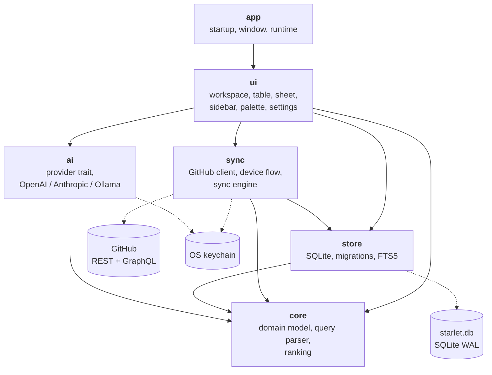

Starlet mirrors your GitHub stars into a local SQLite database and searches that.
The search path never touches the network, so results appear in under a
millisecond whether you are online or not.

This site is the **developer** documentation. It assumes you have the repository
checked out and want to understand or change it. If you only want to run the app,
the [README](https://github.com/prdlk/starlet#readme) is shorter.

## The shape of the thing

Six crates in one Cargo workspace. Dependencies point downward, and nothing below
`ui` knows a window exists. That single rule is what makes the query parser
property-testable, the ranking formula benchmarkable, and the sync engine
testable against `wiremock` fixtures instead of github.com.

## Start here

<CardGroup cols={2}>
  <Card title="Build and run" href="/getting-started" icon="rocket">
    Toolchain, platform packages, and the first `cargo run`.
  </Card>
  <Card title="Architecture" href="/architecture" icon="layers">
    The layering rule, the runtime model, and the two-stage search path.
  </Card>
  <Card title="Crate reference" href="/crates" icon="package">
    What each crate owns, its public API, and its invariants.
  </Card>
  <Card title="Extension guides" href="/guides" icon="wrench">
    Add a query prefix, a migration, a synced field, an AI provider, a view.
  </Card>
  <Card title="Reference" href="/reference/query-syntax" icon="book-open">
    Query syntax, ranking, the SQL schema, keybindings, environment.
  </Card>
  <Card title="Decisions" href="/adr" icon="scale">
    Eleven ADRs — one per decision that would otherwise need archaeology.
  </Card>
</CardGroup>

## The four things it does

**Search.** Fuzzy matching on `owner/name` blended with BM25 full-text over
descriptions, topics, and tags. `hlxed` finds `helix-editor`; `wings` finds
`sharkdp/bat`. See [Ranking](/reference/ranking).

**Filter.** Query prefixes — `lang:rust`, `tag:cli`, `owner:tokio-rs`,
`stars:>1000`, `is:archived`, `sort:recent` — plus a sidebar of tag and group
facets. See [Query syntax](/reference/query-syntax).

**Sync.** A background engine pages your stars from GitHub into SQLite, keeps
metadata fresh with conditional requests, and notices unstars. Once at launch,
then every fifteen minutes. See [Sync pipeline](/architecture/sync-pipeline).

**Tag, optionally.** Bring your own key for OpenAI, Anthropic, or a local Ollama
and Starlet will tag and group your stars. It ships no key, runs nothing on
launch, shows the estimated cost before it starts, and never overwrites a tag you
wrote yourself. See the [`ai` crate](/crates/ai).

## Performance budgets

These are enforced by tests, not aspirations. Measured on a Ryzen AI Max+ 395,
debug profile, 5 000 repositories:

| | Median | Thread |
| --- | --- | --- |
| Fuzzy rank + sort, worst-case one-character query | 0.9 ms | application |
| Filter + rank, three clauses | 1.1 ms | application |
| Browse ordering, empty query | 0.1 ms | application |
| FTS5 BM25 query | 3.4 ms | I/O runtime |
| Load the whole mirror into memory | 75 ms | I/O runtime |

The window paints before either of the last two has run. Guarded by
`crates/core/tests/ranking_performance.rs` and
`crates/store/tests/search_performance.rs`; run them with `just bench`.
